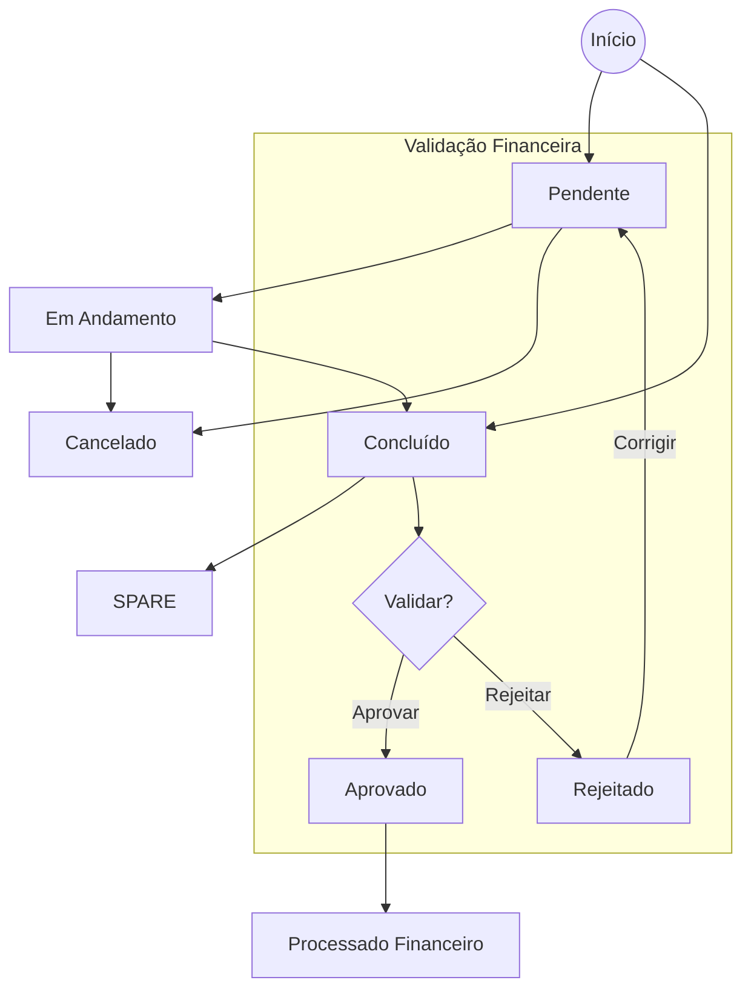

# Máquina de Estados: Chamados

Este documento define os estados válidos e as transições permitidas para o ciclo de vida de um Chamado.

## Estados de Chamado (`status_chamado`)

| Estado | Descrição |
|--------|-----------|
| **Pendente** | Estado inicial da criação manual ou importação simples. Ainda não atendido. |
| **Em Andamento** | Técnico iniciou o deslocamento ou atendimento. |
| **Concluído** | Atendimento finalizado operacionalmente. Pronto para validação financeira. Default para importação em lote. |
| **SPARE** | Atendimento especial de troca de peças ou logística interna. |
| **Cancelado** | Chamado abortado antes da conclusão. Estado terminal sem efeito financeiro. |
| **Finalizado** | *(Legacy)* Antigo estado de conclusão. Tratado como sinônimo de Concluído. |

## Estados de Validação (`status_validacao`)

Este fluxo corre em paralelo ao status operacional, mas só avança se o chamado estiver `Concluído`.

| Estado | Descrição |
|--------|-----------|
| **Pendente** | Aguardando revisão na Inbox de Validação. |
| **Aprovado** | Validado por Admin. Liberado para processamento financeiro. |
| **Rejeitado** | Rejeitado por inconformidade (ex: evidência faltante). Não gera pagamento. |
| **Excluído** | Soft delete. Mantido para auditoria, mas invisível operacionalmente. |

## Diagrama de Transições

## Regras de Negócio

1. **Gate Financeiro Unificado**:
   - Um chamado SÓ entra em folha de pagamento se `status_chamado='Concluído'` E `status_validacao='Aprovado'`.

2. **Imutabilidade Pós-Pagamento**:
   - Chamados pagos (`pago=True`) ou em lote (`pagamento_id!=None`) NÃO podem sofrer alteração de status nem exclusão.

3. **Soft Delete**:
   - A exclusão via sistema apenas muda `status_validacao` para `Excluído` e preenche `motivo_rejeicao`.

4. **Pricing de Revenue Assurance**:
   - Itens sem preço definido no contrato geram alerta (`Notification`) para Admins, mas não bloqueiam o fluxo (valor R$ 0,00).
   - O status `Concluído` é pré-requisito para o cálculo final de custos.

## Constraints de Banco (Migration a006)

Os campos de status possuem `CHECK CONSTRAINTS` no banco de dados para garantir que apenas valores válidos sejam persistidos, prevenindo corrupção de dados por erros de código.
